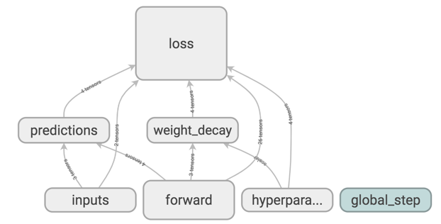
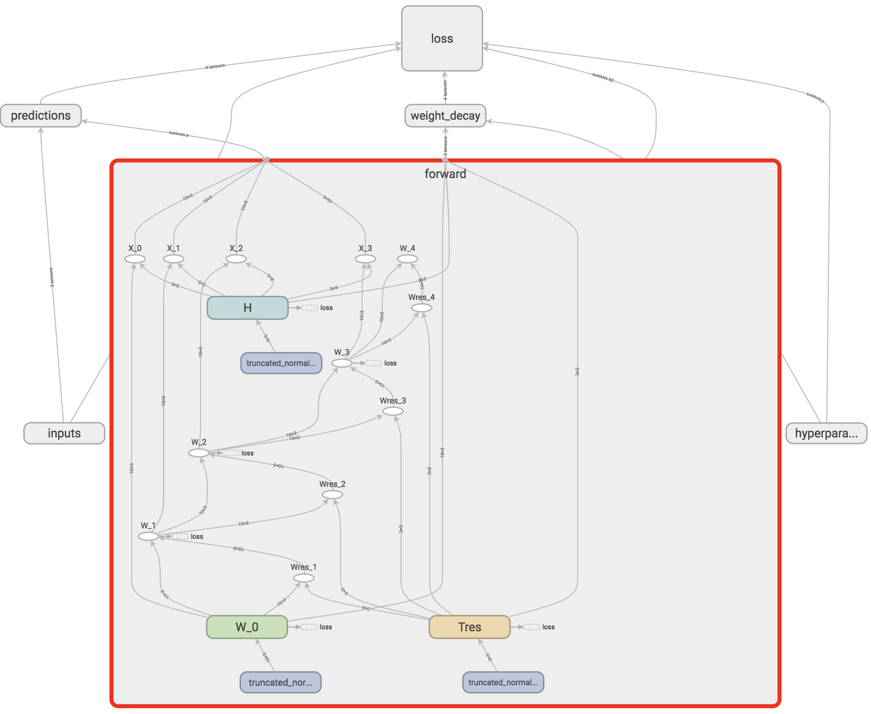

# Matrix Factorization for Sequential Data

Matrix factorization is used in recommender systems, topic modeling, data compression, and anomaly detection. It is useful for learning latent representations of fixed entities. Sometimes, such entities are changing with respect to time. In such cases, we can extend conventional matrix factorization methods to _sequential_ matrix factorization.

## Formulation
Matrix factorization deals with the following problem.

Here we deal with the problem where you have a sequence of data

each with a decomposition of

subject to a transition rule based on transition matrix 

 is the feature basis, which is consistent over the entire sequence, and  is the condensed representation of  on the feature basis spanned by the rows of 

## Loss Function

The loss function for optimization is the distance (e.g., frobenius norm) of the predicted values of  from their true values, as provided by the data. The trainable variables are . The optimization objective is the long expression below.

The first term is the *compression* loss, or how much data is lost going from the raw representation to the condensed representation. The second term is the *transition* loss, or how well the transition rule is able to predict the next step, given a compression scheme. The third and fourth terms are weight decay regularizers aimed at getting better generalization. They have a 1-norm in the axis corresponding to the features to enforce sparsity, and a 2-norm in the other axis. The final term is a nonnegativity enforcer, which has zero loss for positive values. The relative importances of each loss term are given by the coefficients 

## Usage

### Requirements
- `tensorflow 1.9` (haven't tested on other versions)
- `numpy`

### Running the code

The code is self contained within the  file. Toy data is included in the  function. Change this to integrate your data.

### Computation graph visualization
An interactive tensorboard of the constructed computation graph is in the following link
https://boards.aughie.org/board/IQg3vzIEAcHviNIniDicLLQ-U_E/

Screenshot of high level graph

The main feed-forward computations are enclosed within the  block.

## Results on graph data 

### Data exploration and normalization

Typically graph features (such as those extracted by ReFeX) can contain large variations in the values. To make the optimization work, we must first normalize the graph features values. To do this, we mean-standardize each feature's marginal distribution. We show the data exploration and normalization process in this notebook https://colab.research.google.com/drive/13Gj8qYA2Nl8jucQbWaYeuclmaStkwODL

A gif of all the nonzero feature marginal distributions is shown here. The data comes from features extraction from a graph of transactions at a financial institution.

### Results

General (negative values allowed) matrix factorization yields the following training curve.  stands for criterion, which here is the mean-squared-error (MSE) of all the trainable parameters. The training criterion goes way down, indicating that the optimizer is working well. There is a bit of generalization performance, as the test criterion does down about 15%, but better regularizers and more data can make this improve more. The interactive version of these plots are here https://www.comet.ml/wronnyhuang/nmf/e1e9bd13799448f3bf04365e5aec57c4.

