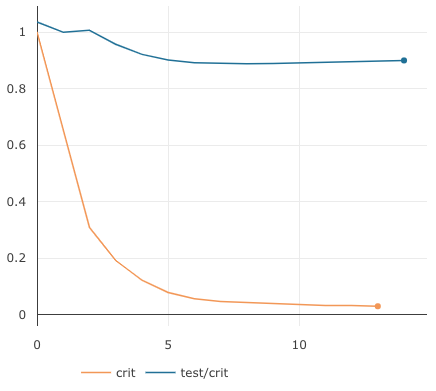

# Matrix Factorization for Sequential Data

Matrix factorization is used in recommender systems, topic modeling, data compression, and anomaly detection. It is useful for learning latent representations of fixed entities. Sometimes, such entities are changing with respect to time. In such cases, we can extend conventional matrix factorization methods to _sequential_ matrix factorization.

## Formulation
Matrix factorization deals with the following problem.

Here we deal with the problem where you have a sequence of data

each with a decomposition of

subject to a transition rule based on transition matrix 

HW_iX_iHX_i\newcommand{\norm}[1]{\left\lVert#1\right\rVert}L = \sum_i^N \norm{x}T, W_0, and Hmain.pyModel.fitforwardcrit$ stands for criterion, which here is the mean-squared-error (MSE) of all the trainable parameters. The training criterion goes way down, indicating that the optimizer is working well. There is a bit of generalization performance, as the test criterion does down about 15%, but better regularizers and more data can make this improve more. The interactive version of these plots are here https://www.comet.ml/wronnyhuang/nmf/e1e9bd13799448f3bf04365e5aec57c4.

